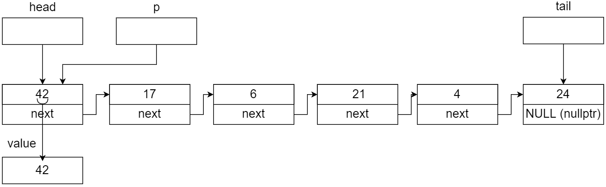
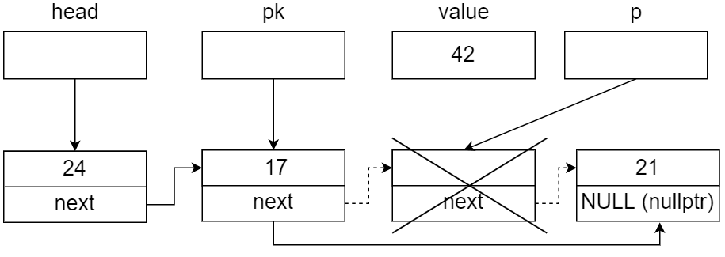

= Лабораторна робота № 6

== Динамічний розподіл пам'яті. Лінійні зв'язані списки

*Тема:* Розробка та реалізація програм із використанням лінійних динамічних списків.

*Ціль роботи:* отримати навички створення та реалізації програм, що використовують структури лінійного динамічного списку та реалізують операції з ними.

=== Основні поняття

Лінійні списки — найпростіша форма організації даних з рекурсивною
структурою. Цю форму застосовують найчастіше тоді, коли треба обробити деяку
сукупність даних, кількість елементів яких заздалегідь не визначена, а взаємний
порядок проходження відіграє важливу або вирішальну роль.
Лінійний односпрямований (однозв'язний) список – дані динамічної структури,
що являють собою сукупність лінійно зв'язаних однорідних елементів, до яких
дозволяється додавати елементи до голови (початку) або в кінець (хвіст) списку,
між будь-якими двома іншими та видаляти будь-який елемент

image::img/SingleLinkedList.png[]

Даний тип можна описати в такий спосіб:

[source,c++]
----
struct element
{
    typeelem data;
    element *next;
};
----

[source,kotlin]
----
data class Element<T>(var data: T, var next: Element<T>? = null)
----

Також, при реалізації лінійного зв'язаного списка мовою Kotlin, необхідно створити клас List, що буде мати посилання head та tail та всі операції реалізовуватимуться як функції у цьому класі.

[source,Kotlin]
----

----

Для роботи з лінійним однозв'язним списком потрібні такі покажчики:

. на голову списку Head;
. на кінець списку Tail, але можна обійтися й без нього;
. на k-й елемент списку;
. тимчасовий для виділення пам'яті під елементи, які додаються, і для
звільнення елементів, що видаляються (ідентифікатор р).

Оскільки у мові Kotlin немає покажчиків, використовуються дуже схожі на них за сенсом, але більш безпечні *посилання*.

Розглянемо основні дії над однозв’язним списком.

_**Примітка.** Тут і далі, під терміном "покажчик" ми будемо розуміти покажчики (вказівники) в мовах C/C++ та посилання в мові Kotlin._

*Ініціалізація списку*

У разі застосування покажчика на кінець списку ініціалізація буде мати такий
вигляд:

image::img/init.png[]

Мовою С++ це буде записано так
[source,c++]
----
element *head, *tail;
head = nullptr;
tail = nullptr;
----

або коротшим записом:
[source,c++]
element *head = nullptr, *tail = nullptr;

У Kotlin
[source,Kotlin]
----
var head : Element<T>? = null
var tail : Element<T>? = null
----

Якщо покажчик на кінець списку не використовують, ініціалізувати треба
тільки один покажчик:

image::img/init1.png[]

[source,c++]
----
element *head;
head = nullptr;
----

або одним рядком:

[source,c++]
element *head = nullptr;

Мовою Kotlin
[source,Kotlin]
var head : Element<T>? = null

Таким чином, список ініціалізований, але не містить жодного елемента. Тепер
можна заповнювати список з голови (додаючи знову створений елемент списку
після попередніх) або з кінця (додаючи знову створений елемент перед
попереднім).

*_Додавання елементів до списку із використанням двох покажчиків (на голову
і кінець списку)_*

Додавання першого елемента до списку та додавання елемента в кінець
списку відрізняється. У будь-якому випадку необхідний ще один покажчик
*р* на поточний (новий) елемент.

_Додавання першого елемента до списку_

. Вихідний стан:

image::img/init.png[]

[source,c++]
----
element *head = nullptr, *tail = nullptr;
element *p;
----

[source,Kotlin]
var head: Element<T>? = null
var tail: Element<T>? = null
var p: Element<T>? = null

[start=2]
. Виділення пам'яті під перший елемент списку й занесення інформації до
нього:

image::img/step1.png[]

C&#43;&#43;

[source, c++]
----
p = new element;        // виділення пам´яті під новий елемент
p->data = 42;           // присвоєння значення іформаційній частині
p->next = nullptr;      // присвоєння покажчику на наступний елемент значення ознаки кінця
----

Kotlin

[source,Kotlin]
----
p = Element(42)    // присвоєння значення інформаційній частині, посилання на наступний елемент автоматично отримає значення null
----

Опис покажчика на поточний елемент і виділення пам′яті краще записувати
одним рядком (у мові Kotlin було саме так):

C&#43;&#43;

[source,c++]
element *p = new element;

[start=3]
. Встановлення покажчиків head, tail на створений перший елемент:

C&#43;&#43; та Kotlin

[source,c++]
----
head = p;
tail = p;
----

_Додавання елемента в кінець списку_

. Вихідний стан:

image::img/step1a.png[]

[start=2]
. Виділення пам'яті під новий елемент списку й занесення інформації до
нього:

image::img/step2a.png[]

C&#43;&#43;

[source,c++]
----
element *p = new element;
p->data = 24;            // присвоєння значення іформаційній частині
p->next = nullptr;       // присвоєння покажчику на наступний елемент значення ознаки кінця
----

Kotlin
[source,Kotlin]
----
val p = Element(24)
----

[start=3]
. Встановлення зв'язку між останнім елементом списку й новим, а також
переміщення покажчика кінця списку на новий елемент:

C&#43;&#43;

[source,c++]
----
tail->next = p;
tail = p;
----

Kotlin
[source,Kotlin]
----
tail!!.next = p
tail = p
----

Функція додавання елемента в кінець списку з використанням покажчиків
head, tail мовою C&#43;&#43; може мати такий вигляд:

[source,c++]
----
void addToList(element **head, element **tail, typeelem value)
{
    //виділення пам'яті під новий елемент списку
    element *p = new element;
    //заповнення інформаційної частини
    p->data = value;
    //встановлення посилання останнього елемента
    p->next = nullptr;
    //якщо список порожній
    if (*head == nullptr) // або if (!(*head))
        //встановлення покажчика head на перший елемент
        *head = p;
       //інакше встановлення зв'язку між останнім елементом списку й новим
    else (*tail)->next = p;
    //встановлення покажчика кінця списку на новий елемент
    *tail = p;
}
----

Та ж сама операція мовою Kotlin:
[source,Kotlin]
----
fun addToList(value: T) {
    // виділення пам'яті під новий елемент списку, заповнення інформаційної частини та встановлення посилання останнього елемента
    val p = Element(value)
    // якщо список порожній
    if (head==null) {
        // встановлення посилання head на перший елемент
        head = p
    } else {
        // інакше встановлення зв'язку між останнім елементом списку й новим
        tail!!.next = p
    }
    // встановлення посилання кінця списку на новий елемент
    tail = p
}
----

Під час виклику треба вказувати адреси покажчиків (покажчик на покажчик) head і tail

Мовою C&#43;&#43;
[source,c++]
addToList(&head, &tail, value)

*_Додавання елементів до списку з використанням одного покажчика
Мовою Kotlin дещо простіше:

[source,Kotlin]
// необхідно звернутись до об'єкта list та викликати його функцію
list.addToList(value)

*_Додавання елементів у список з використанням одного покажчика
(на голову списку)_*

Додавання першого елемента до списку майже не відрізняється від аналогічної
операції з використанням двох покажчиків

_Додавання першого елемента до списку_

. Вихідний стан:

Мовою C&#43;&#43;

[source,c++]
head = nullptr;

Мовою Kotlin

[source,Kotlin]
head = null

[start=2]
. Виділення пам'яті під перший елемент списку й занесення інформації до
нього:

image::img/step2b.png[]

C&#43;&#43;

[source,c++]
----
element *p= new element;
p->data = 42;
p->next = nullptr;
----

Kotlin

[source,Kotlin]
----
val p = Element(42)
----

[start=3]
. Встановлення покажчика head на створений перший елемент:

image::img/step3b.png[]

Ця дія записується мовами C&#43;&#43; та Kotlin майже однаково

[source,c++]
head = p;

[source,Kotlin]
head = p

Додавати елементи можна й до вже існуючого списку: в голову списку,
всередину, після заданого та перед заданим, елементом

_Додавання елемента в голову списку_

. Вихідний стан:

[start=2]
. Виділення пам'яті під новий елемент списку й заповнення інформаційного
поля:

image::img/step2c.png[]

C&#43;&#43;

[source,c++]
element *p = new element;
p->data = 24;

Kotlin

[source,Kotlin]
val p = Element(24)

[start=3]
. Встановлення зв'язку між першим елементом списку й новим:

C&#43;&#43;

[source,c++]
p->next = head;

Kotlin

[source,Kotlin]
p.next = head

[start=4]
. Переміщення покажчика на голову списку на новий елемент:

C++

[source,c++]
head = p;

Kotlin
[source,Kotlin]
head = p

Функція додавання елемента в голову списку може мати такий вигляд:

Мовою C&#43;&#43;

[source,c++]
void addInHead(element **head, typeelem value)
{
    // виділення пам'яті під новий елемент списку
    element *p = new element;
    // заповнення інформаційної частини
    p->data = value;
    // встановлення зв'язку між першим елементом списку й новим
    p->next = *head;
    // Переміщення покажчика на голову на новий елемент
    *head = p;
}

Мовою Kotlin

[source,Kotlin]
fun addInHead(value: T) {
    // виділення пам'яті під новий елемент списку та заповнення інформаційної частини
    val p = Element(value)
    // встановлення зв'язку між першим елементом списку й новим
    p.next = head
    // переміщення посилання на голову на новий елемент
    head = p
}

_Виведення елементів списку починаючи від голови_

Для виведення елементів списку на екран, потрібно використовувати допоміжне посилання, якому на початку надається значення голови списку. Після опрацювання кожного елемента (виведення на екран його інформаційної частини), відбувається перехід до наступного. Процес продовжується доки покажчик не стане дорівнювати nullptr через досягнення кінця списку:

Мовою C&#43;&#43;

[source,c++]
----
void printList(element *head) {
    element *p = head;
    while (p!=nullptr) {
        cout << p->data << " ";
        p = p->next;
    }
}
----

Мовою Kotlin

[source,Kotlin]
----
fun printList() {
    var p = head
    while (p!=null) {
        println("${p.data} ")
        p = p.next
    }
}
----

Також можна написати рекурсивну функцію виведення елементів списку:

Мовою C&#43;&#43;

[source,c++]
----
void printListRec(element *head) {
    if (head != nullptr) {
        cout << head->data << " ";
        printListRec(head->next);
    }
}
----

Мовою Kotlin

[source,Kotlin]
----
fun printListRec(head: Element<T>?) {
    if (head != null) {
        print("${head.data} ");
        printListRec(head.next)
    }
}
----

Для виведення всього списку представлені функції треба викликати з фактичним
параметром head, який зберігає адресу першого елемента. Функції придатні
також і для виведення на екран частини списку, для цього як фактичний параметр
треба передати адресу елемента, з якого буде починатись виведення списку.

_Пошук елемента з певними властивостями_

Функція пошуку елемента в списку, текст якої наведено нижче, повертає
покажчик на той елемент списку, що містить у своїй інформаційній частині
значення, задане користувачем; якщо ж такий елемент не знайдено, функція
повертає *nullptr*.

Функції передають два параметри: покажчик на голову списку, у
якому буде відбуватися пошук і значення інформаційної частини елемента
списку, яке необхідно знайти.
Алгоритм пошуку дуже простий: будемо послідовно переглядати елементи
списку й порівнювати значення інформаційного поля із заданим значенням. Цей
процес закінчується у двох випадках:

- Черговий елемент списку містить задане значення, тоді функція повертає
покажчик на даний елемент та припиняє свою роботу;
- список було вичерпано, тобто повністю переглянуто, але задане значення
не знайдено; тоді функція повертає «порожнє» посилання nullptr (null - у мові Kotlin).

Мовою C&#43;&#43;

[source,c++]
----
element * findNode(element * head, typeelem x)
{
    // покажчик на перший елемент списку
    element * node = head;
    while(node != nullptr) {    // або while(node)
        //якщо заданий елемент знайдено
        if (node->data == x)
            //закінчення пошуку і повернення покажчика на цей елемент
            return node;
            // у іншому випадку
        else
            // перехід на наступний елемент списку
            node = node->next;
    }
    // якщо список вичерпано, то шуканий елемент не знайдено,
    // тому повертаємо «порожнє» значення
    return nullptr;
}
----

Мовою Kotlin

[source,Kotlin]
----
fun findNode(head : Element<T>?, x: T) : Element<T>? {
    var p = head
    while (p != null) {
        if (p.data == x) break
        p = p.next
    }
    return p
}
----

_Додавання елемента всередину списку після заданого елемента_

Вважаємо, що адреса заданого елемента відома і зберігається у покажчику `pk`. Для додавання нового елемента після заданого необхідно:

. створити новий динамічний об'єкт (новий елемент списку);
. у поле `data` об'єкта занести задану інформаційну частину;
. у поле `next` даного об'єкта занести посилання, взяте з відповідного поля
того елемента, за яким повинен іти новий елемент (покажчик `pk`);
. у поле `next` того елементу, за яким повинен слідувати новий елемент, занести
посилання на цей елемент (покажчик `pk`).

[start=1]
. *Вихідний стан:*

[start=2]
. *Виділення пам'яті під новий елемент списку й заповнення інформаційного
поля:*

Мовою C&#43;&#43;

[source,c++]
----
element * p= new element;
p->data = 6;
----

Мовою Kotlin
[source,Kotlin]
----
val p = Element(6)
----

[start=3]
. *Встановлення зв'язку між новим і наступним за ним елементом:*

Мовою C&#43;&#43;

[source,c++]
----
p->next = pk->next;
----

Мовою Kotlin

[source,Kotlin]
----
p.next = pk.next
----

[start=4]
. *Перестановка зв'язку заданого елемента на новий елемент:*

Мовою C&#43;&#43;

[source,c++]
pk->next = p;

Мовою Kotlin
[source,Kotlin]
pk.next = p

Таким чином, опис функції додавання в список заданого елемента після
визначеного може мати такий вигляд:

Мовою C&#43;&#43;

[source,c++]
----
void addNodeAfter(element ** pk, typeelem value)
{
    //створення нового динамічного об'єкта
    element * p = new element;
    //запис інформаційної частини
    p->data = value;
    //заповнення покажчика на наступний елемент
    p->next = (*pk)->next;
    //додавання нового елемента в список
    (*pk)->next = p;
}
----

Мовою Kotlin

[source,Kotlin]
----
fun addNodeAfter(pk : Element<T>, value : T) {
    val p = Element(value)
    p.next = pk.next
    pk.next = p
}
----

_Додавання елемента всередину списку *перед* заданим елементом_

Якщо є адреса елемента, який передує заданому, то необхідну дію можна виконати так, як описано вище. Але якщо є адреса тільки заданого елемента, то задача ускладнюється.

У цьому випадку замість того, щоб ще раз від початку списку шукати попередній
елемент, значно простіше виконати вставку перед заданим елементом у такий спосіб
(вважаємо, що адреса заданого елемента відома і зберігається у вказівнику pk):

. зробити вставку нового елемента після заданого елемента (таким чином, як це
описано вище);
. поміняти місцями значення інформаційних полів заданого й нового елементів;
. переставити покажчик pk на новий вставлений елемент, який вже містить
значення заданого елемента.

[start=1]
. *Вихідний стан:*

[start=2]
. *Стан після додавання елемента 6 після елемента 21.*

image::img/step2e.png[]

Мовою C&#43;&#43;

[source,c++]
----
element * p= new element;
p->data = 6;
p->next = pk->next;
pk->next = p;
----

Мовою Kotlin
[source,Kotlin]
----
val p = Element(6)
p.next = pk.next
pk.next = p
----

[start=3]
. *Обмін місцями значень інформаційних полів заданого й нового елементів
(змінна tmp повинна мати той же тип, що й інформаційне поле елемента списку):*

Мовою C&#43;&#43;

[source,c++]
----
typeelem tmp = pk->data;
pk->data = p->data;
p->data = tmp;
----

Мовою Kotlin
[source,Kotlin]
----
val tmp = pk.data
pk.data = p.data
p.data = tmp
----

. Перестановка вказівника pk на новий елемент:

Мовою C&#43;&#43;

[source,c++]
pk = p;

Мовою Kotlin

[source,Kotlin]
pk = p

*_Видалення елементів списку_*

Під час видалення першого та останнього елемента списку
необхідно не загубити значення покажчика на голову та ознаку кінця списку.

_Видалення першого елемента_

. Вихідний стан:

[start=2]
. Встановлення додаткового покажчика р на елемент, який видаляють, і
вибирання з нього інформації:

Мовою C&#43;&#43;

[source,c++]
----
element * p = head;
value = p->data;
----

Мовою Kotlin
[source,Kotlin]
----
val p = Element(value)
----

[start=3]
. Перестановка покажчика на голову списку на наступний елемент,
звільнення пам'яті першого елемента списку:

Мовою C&#43;&#43;

[source,c++]
----
head = head->next; // або head = p->next;
delete p;
----

Мовою Kotlin
[source,Kotlin]
----
head = head.next
----

Функцію, що реалізує видалення першого елемента списку, наведено нижче.

Мовою C&#43;&#43;

[source,c++]
----
typeelem deleteFirst(element ** head)
{
    //зберігаємо адресу елемента, який потрібно видалити
    element * p = *head;
    //отримуємо з нього інформацію
    typeelem value = p->data;
    //встановлюємо голову списку на наступний елемент
    *head = p->next;
    //видаляємо перший елемент
    delete p;
    // повертаємо значення видаленого елемента
    return value;
}
----

Мовою Kotlin

[source,Kotlin]
----
fun deleteFirst() : T? {
    val value = head?.data
    head = head?.next
    return value
}
----
Зверніть увагу на те, що Kotlin не вимагає явного звільнення пам'яті.
З іншого боку, Kotlin вимагає перевірки на null при отриманні значення за посиланням

_Видалення останнього елемента списку_

. Для видалення останнього елемента списку необхідно знати адресу
передостаннього елемента для збереження в його посилальній частині ознаки
кінця списку nullptr.

Мовою C&#43;&#43;

[source,c++]
----
element * p = head;
while (p->next->next != nullptr) p = p->next;
----

Мовою Kotlin
[source,Kotlin]
----
val p = head
while (p?.next?.next != null) p = p.next
----

[start=2]
. Якщо у реалізації списку використовується покажчик на останній елемент tail, вибираємо значення з нього, звільнюємо пам'ять, на яку він вказує.
Якщо ж такого елемента немає, то визначаємо його як `temp = p->next;` вибираємо значення з нього, звільнюємо пам'ять, на яку він вказує

Мовою C&#43;&#43;

[source,c++]
----
typeelement value = p->next->data;
// або value = tmp->data;
// або, якщо є покажчик tail: value = tail->data;
delete p->next;
----

Мовою Kotlin
[source,Kotlin]
----
val value = p?.next?.data   // або val value = tail?.data
----

[start=3]
. Фіксація кінця списку (встановлення посилального поля останнього
елемента в nullptr, та покажчика tail):

image::img/step3g.png[]

Мовою C&#43;&#43;

[source,c++]
p->next = nullptr;
tail = p; // якщо покажчик tail використовується

Мовою Kotlin
----
p?.next = null
tail = p
----

Функцію, що реалізує видалення останнього елемента списку, описано нижче.

Мовою C&#43;&#43;

[source,c++]
----
typeelem deleteLast(element * head)
{
     //знаходження передостаннього елемента списку
     element * p = head;
     while (p->next->next != nullptr) p = p->next;
     //збереження адреси останнього елемента
     element * temp = p->next; // tail
     //вибирання з нього інформації
     typeelem value = p->next->data; // або value = temp->data;
     //видалення останнього елемента
     delete temp;
     //збереження ознаки кінця списку
     p->next = nullptr;
     return value;
}
----

Мовою Kotlin

[source,Kotlin]
----
fun deleteLast() : T? {
    var p = head
    while (p?.next?.next != null) p = p.next
    val value = p?.next?.data
    p?.next = null
    tail = p
    return value
}
----

*_Видалення елемента, що стоїть після заданого_*

Для видалення елемента зі списку достатньо змінити посилання
попереднього йому елемента, причому як нове посилання цього елемента треба
прийняти посилання елемента, який видаляємо. Варто звернути увагу на те, що в
результаті виконання даної операції виключений зі списку елемент продовжує
існувати й займати місце в пам'яті комп'ютера, хоча й стає недоступним для
використання. Як бачимо, такий спосіб може призвести до неефективного
використання пам'яті через зберігання в ній виключених елементів списку. Для
усунення цього недоліку в описі функції видалення потрібно обов′язково
передбачити знищення виключеного зі списку елемента

. Вихідний стан:

[start=2]
. Встановлення додаткового вказівника р на елемент списку, який
видаляємо, і вибирання з нього інформації:

Мовою C&#43;&#43;

[source,c++]
----
element * p = pk->next;
typeelem value = p->data;
----

Мовою Kotlin

[source,Kotlin]
----
val p = pk.next
val value = p?.data
----

[start=3]
. Встановлення зв'язку між k-м і (k+2)-м елементами та звільнення пам'яті
(k+1)-го елемента, який видаляють:

Мовою C&#43;&#43;

[source,c++]
----
pk->next = p->next;
//або
//pk->next = pk->next->next;
delete p;
----

Мовою Kotlin

[source,Kotlin]
----
pk.next = p?.next
// або pk.next = pk.next?.next
----

Функцію, що реалізує видалення елемента, який стоїть після заданого,
описано нижче.

Мовою C&#43;&#43;

[source,c++]
----
typeelem deleteElementAfter(element * pk)
{
    // збереження посилання на елемент, який видаляємо
    element * p = pk->next;
    // збереження інформації
    typeelem value = pk->next;
    //змінюємо посилання, виключаючи елемент зі списку
    pk->next = pk->next->next;
    //або pk->next = р->next;
    //звільняємо пам’ять
    delete p;
    return value;
}
----

Мовою Kotlin

[source,Kotlin]
----
fun deleteElementAfter(pk : Element) : T? {
    val p = pk.next
    val value = p?.data
    pk.next = pk.next?.next
    return value
}
----

*_Видалення заданого елемента списку_*

Видалення заданого елемента можна здійснити також, як описано вище, якщо
відома адреса попереднього елемента списку. Для цього можна застосувати функцію пошуку попереднього елементу findPrev:

Мовою C&#43;&#43;

[source,c++]
----
element * findPrev(element * head, element * target)
{
    //поки не знайдено шуканий елемент
    while(head->next != target)
    {
        //перевіряємо, якщо список вичерпаний,
        if(!head)
            //повертаємо порожнє значення
            return nullptr;
        //або переходимо на наступний елемент
        head = head->Link;
    }
    //повертаємо шукану адресу
    return head;
}
----

Мовою Kotlin

[source,Kotlin]
----
fun findPrev(head : Element<T>, target : Element<T>) : Element<T> {
    var p = head
    while (p.next!=target) p = p.next!!
    return p
}
----

Однак можна обійтися й без додаткового пошуку, для чого потрібно:

. скопіювати значення інформаційного поля "потрібного" наступного елемента в
інформаційне поле заданого елемента, який видaляємо;
. видалити наступний елемент замість заданого

[start=1]
. Вихідний стан:

[start=2]
. Встановлення додаткового покажчика р на наступний елемент списку,
вибирання інформації із заданого елемента, який видаляємо, і копіювання корисної
інформації з наступного елемента в заданий елемент:

Мовою C&#43;&#43;

[source,c++]
----
element * p = pk->next;
typeelem value = pk->data;
pk->data = p->data;
----

Мовою Kotlin

[source,Kotlin]
----
val p = pk.next
val value = pk.data
pk.data = p!!.data
----

[start=3]
. Встановлення зв'язку між k-м і (k+2)-м елементами й звільнення пам'яті
(k+1)-го елемента, який видаляємо замість k-го:

Мовою C&#43;&#43;

[source,c++]
----
pk->next = p->next;
//або
//pk->next = pk->next->next;
delete p;
----

Мовою Kotlin

[source,Kotlin]
----
pk.next = p.next
----

Функцію, що реалізує видалення заданого елемента, описано нижче:

Мовою C&#43;&#43;

[source,c++]
----
typeelem delElement(element * pk)
{
    // збереження посилання на елемент, який видаляємо
    element * p = pk->next;
    // збереження інформації
    typeelem value = pk->data;
    //обмін елементів місцями
    pk->data = p->data;
    //змінюємо посилання, виключаючи елемент зі списку
    pk->next = pk->next->next;
    //або pk->next = р->next;
    //звільняємо пам’ять
    delete p;
    return value;
}
----

Мовою Kotlin

[source,Kotlin]
----
fun deleteElement(pk : Element<T>): T {
    val p = pk.next
    val value = pk.data
    pk.data = p!!.data
    pk.next = p.next
    return value
}
----

*_Видалення списку_*

Наприкінці роботи програми з однозв'язним списком необхідно видалити
список повністю, щоб звільнити пам'ять, у протилежному разі після певної
кількості запусків програми, що працює зі списками, можливі помилки у зв'язку з
недоступністю комірок пам'яті через некоректне завершення роботи програми.
Видалення кожного елемента списку аналогічне до видалення першого
елемента списку:

- Зберігаємо адресу першого елемента в допоміжному покажчику;
- Покажчик на голову списку переміщуємо на другий елемент;
- Видаляємо перший елемент;
- Повторюємо ці дії, поки список не стане порожнім.

Або:

- Зберігаємо адресу другого елемента в допоміжному покажчику;
- Видаляємо перший елемент, застосовуючи покажчик на голову;
- Покажчику на голову списку передаємо адресу другого елемента;
- Повторюємо ці дії, поки список не стане порожнім.

Функція видалення списку може мати такий вигляд:

[source,c++]
----
void dropList1(element ** head)
{
    element * p;
    // поки список непорожній
    while(head)
    {
        // збереження посилання на перший елемент, який видаляємо
        p = *head;
        // встановлення покажчика голови списку на наступний елемент списку
        *head = p->next;
        //видалення першого елемента
        delete(p);
    }
}
----

або

[source,c++]
----
void dropList2(element ** head)
{
    element * p;
    while(head)
    {
        p = head->next;
        delete(*head);
        *head = p;
    }
}
----

Мовою Kotlin, завдяки автоматичному прибиранню сміття, достатньо "обнулити" посилання на голову та хвіст списку:

[source,Kotlin]
----
head = null
tail = null
----

== Завдання

=== Завдання 6.1

Запишіть рядки, які будуть виведені на екран дисплею внаслідок виконання фрагментів, поданих у варіантах, при наступному початку програми

_Вказівка: замість N підставити номер варіанта за списком групи_

[source,c++]
----
#include <iostream>

using namespace std;

struct lnk {
    string name;
    int ph;
    lnk *next;
};

int main() {
    int nr, n;
    int *k, *p;
    lnk *cR, *fst;
    string nAr[3];
    int pAr[3];
    cin >> n;
    k = &n;
    p = k;
    *p = *p + 2;
    cout << k << " " << *p << endl;
    nAr[0] = "AAA";
    nAr[1] = "BBBB";
    nAr[2] = "CCCC";
    pAr[0] = 2222;
    pAr[1] = 333;
    pAr[2] = 4444;
    nr = sizeof(lnk);
    fst = nullptr;
    for (int i = 0; i < 3; i++) {
        cR = new lnk;
        cR->name = nAr[i];
        cR->ph = pAr[i];
        cR->next = fst;
        fst = cR;
    }
    // код згідно варіанту додати сюди
}
----

==== Варіанти 1-5

[source,c++]
----
    fst->next = fst->next->next;
    cout << cR->ph << endl;
    cR=fst;
    while (cR != nullptr){
        cout << cR->name << " " << cR->ph << endl;
        cR=cR->next;
    }
    cout << "nr = " << nr;
    cout << " " << fst->name << endl;
----

==== Варіанти 6-10

[source,c++]
----
    fst=fst->next;
    cout << cR->ph << endl;
    cR=fst;
    while (cR != nullptr) {
        cout << cR->name << " " << cR->ph << endl;
        cR=cR->next;
    }
    cout << "nr=" << nr;
    cout << " " << fst->name << endl;
----

==== Варіанти 11-15

[source,c++]
----
    lnk * p1=new lnk;
    p1->name = nAr[0];
    p1->ph=pAr[0];
    p1->next=fst->next;
    fst->next=p1;
    cout << cR->ph << endl;
    cR=fst;
    for (int i=2;i>0;i--){
        cout << cR->name << " " << cR->ph << endl;
        cR=cR->next;
    }
    cout << "nr=" << nr;
    cout << " " << fst->name << endl;
----

==== Варіанти 16-20

[source,c++]
----
    lnk * p1=new lnk;
    p1->name = nAr[1];
    p1->ph=pAr[1];
    p1->next=fst->next; fst->next=p1;
    cout << cR->ph << endl;
    cR=fst;
    for (int i=0;i<3;i++){
        cout << cR->name << " " << cR->ph << endl;
        cR=cR->next;
    }
    cout << "nr=" << nr;
    cout << " " << fst->name << endl;
----

====  Варіанти 21-25

[source,c++]
----
    cout << cR->ph << endl;
    cR=fst;
    for (int i=1;i<3;i++){
        cout << cR->name << " " << cR->ph << endl;
        cR=cR->next;
    }
    cout << "nr=" << nr;
    cout << " " << fst->name << endl;
----

==== Варіанти 26-30

[source,c++]
----
    cout << cR->ph << endl;
    cR=fst;
    for (int i=2;i>=0;i--){
        cout << cR->name << " " << cR->ph << endl;
        cR=cR->next;
    }
    cout << "nr=" << nr;
    cout << " " << fst->name << endl;
----

=== Завдання 6.2 (C++)

Створити лінійний динамічний список на основі структур та файлів, які були створені в процесі виконання лабораторної роботи №5.

Реалізувати меню для зчитування інформації з файлу у список, виведення елементів списку та виконання операцій згідно з пунктами a-d

=== Завдання 6.3 (C++)

Створити функцію для виведення інформації про елемент лінійного списку за покажчиком на нього та виконати пункт (e) із використанням такої функції. Також створити функції додавання запису у список після вказаного елемента та перед вказаним елементом. Реалізувати можливість видалення вказаного елемента.

.  *Student:* id, Прізвище, Ім’я, По батькові, Дата народження, Адреса, Телефон, Факультет, Курс, Група. +
Запити:

..  список студентів вказаного факультету;
..  список студентів, що народились після вказаного року;
..  список студентів, чиї номери телефонів починаються із вказаної послідовності цифр;
..  список навчальної групи в алфавітному порядку;
..  повну інформацію про першого знайденого студента із вказаним прізвищем.

.  *Customer:* id, Прізвище, Ім’я, По батькові, Адреса, Номер кредитної картки, Номер банківського рахунку. +
Запити:

..  список покупців із вказаним іменем;
..  список покупців, у яких номер кредитної картки знаходиться в заданому інтервалі;
..  список покупців, у яких адреса містить в собі вказану послідовність літер (наприклад, назву міста);
..  список покупців, у яких номер банківського рахунку закінчується на вказану цифру;
..  повну інформацію про покупця із вказаним номером кредитної картки

.  *Patient:* id, Прізвище, Ім’я, По батькові, Адреса, Телефон, Номер медичної картки, Діагноз. +
Запити:

..  список пацієнтів, що мають вказаний діагноз;
..  список пацієнтів, чий номер медичної картки містить указану послідовність цифр;
..  список пацієнтів, у яких адреса починається із вказаної послідовності символів;
..  список пацієнтів, номер медичної карти яких знаходиться в заданому інтервалі;
..  повну інформацію про пацієнта із вказаним прізвищем та номером телефона.

.  *Abiturient:* id, Прізвище, Ім’я, По батькові, Адреса, Телефон, Оцінки. +
Запити:

..  список абітурієнтів, що мають незадовільні оцінки;
..  список абітурієнтів, у яких сума балів вище заданої;
..  список абітурієнтів, у яких номер телефону починається із заданої послідовності цифр (інші символи номера ігноруються)
..  вибрати вказану кількість n абітурієнтів, що мають найбільшу суму балів;
..  повну інформацію про абітурієнта за вказаними Прізвищем, ім’ям та по батькові

.  *Book:* id, Назва, Автор(и), Видавництво, Рік видання, Кількість сторінок, Ціна, Тип палітурки. +
Запити:

..  список книг заданого автора;
..  список книг, що видані вказаним видавництвом;
..  список книг, кількість сторінок у яких належить указаному діапазону;
..  список книг, що видані після заданого року;
..  повну інформацію про книгу із вказаним id

.  *House:* id,  Номер  квартири,  Площа,  Поверх,  Кількість  кімнат,  Вулиця, Тип будівлі, Термін експлуатації. +
Запити:

..  список квартир, які мають задану кількість кімнат;
..  список  квартир,  що мають вказану кількість кімнат  і  розташованих між вказаними поверхами;
..  список квартир, якф експлуатуються не більше R (ввести з клавіатури) років, що знаходяться на вказаній вулиці;
..  список квартир, які мають площу, що більше заданої;
..  повну інформацію про квартиру із вказаним id.

. *Phone:* id,  Прізвище, Ім’я, По батькові, Адреса, Номер кредитної картки, Час міських розмов, Час міжнародних розмов. +
Запити:

..  відомості про абонентів, у яких час міських розмов перевищує вказаний;
..  відомості про абонентів, які користувались міжнародним зв’язком;
..  відомості про абонентів, номер кредитної картки яких закінчується на вказану послідовність цифр;
..  відомості про абонентів в алфавітному порядку;
..  повну інформацію про абонента із вказаним номером кредитної картки

.  *Car:* id, Марка, Модель, Рік випуску, Колір, Ціна, Реєстраційний номер. +
Запити:

..  список автомобілів заданої марки;
..  список автомобілів заданої моделі, які експлуатуються більше n років;
..  список автомобілів вказаного кольору, реєстраційний номер яких містить указану послідовність цифр;
..  список автомобілів вказаного року випуску, ціна яких більше вказаної;
..  повну інформацію про автомобіль із вказаним реєстраційним номером.

.  *Product:* id, Найменування, Тип, Виробник, Ціна, Термін зберігання, Кількість. +
Запити:

..  список товарів заданого найменування;
..  список товарів заданого найменування, ціна яких не більше заданої;
..  список товарів указаного типу заданого виробника;
..  список товарів, термін зберігання яких більше заданого;
..  повну інформацію про товар із вказаним id.

. *Train:* id, Пункт призначення, Номер поїзда, Час відправлення, Число місць (загальних, плацкарт, купе, люкс). +
Запити:

..  список поїздів, які прямують до заданого пункту призначення;
..  список поїздів, які прямують до заданого пункту призначення та відправляються після вказаної години;
..  список поїздів, у яких кількість плацкартних місць більше ніж усіх інших разом;
..  список поїздів, які відправляються до заданого пункту призначення та мають загальні місця;
..  повну інформацію про поїзд за його номером.

Завдання 6.4. Розробити програму згідно з завданнями 6.2 та 6.3 мовою Kotlin